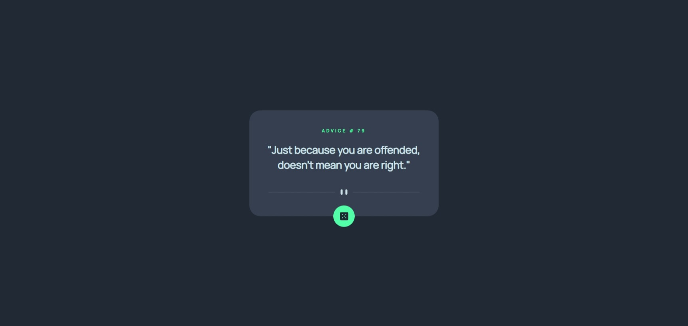

# Frontend Mentor - Advice generator app solution

This is a solution to the [Advice generator app challenge on Frontend Mentor](https://www.frontendmentor.io/challenges/advice-generator-app-QdUG-13db). Frontend Mentor challenges help you improve your coding skills by building realistic projects.

## Table of contents

- [Overview](#overview)
  - [The challenge](#the-challenge)
  - [Screenshot](#screenshot)
  - [Links](#links)
- [My process](#my-process)
  - [Built with](#built-with)
  - [What I learned](#what-i-learned)
- [Author](#author)

## Overview

### The challenge

Users should be able to:

- View the optimal layout for the app depending on their device's screen size
- See hover states for all interactive elements on the page
- Generate a new piece of advice by clicking the dice icon

### Screenshot

### Links

- Solution URL: [Solution URL](https://www.frontendmentor.io/solutions/advice-generator-solution-zwr-bprf-)
- Live Site URL: [Live Site](https://azi-01.github.io/Advice-Generator/)

## My process

### Built with

- Semantic HTML5 markup
- CSS custom properties
- Flexbox
- Javascript
- Advice API

### What I learned
By building this project, I have learned how to use an api to fetch data and display it.

## Author

- Frontend Mentor - [@Azi-01](https://www.frontendmentor.io/profile/Azi-01)
- Instagram - [@Azi00.00](https://www.instagram.com/azi00.00)

